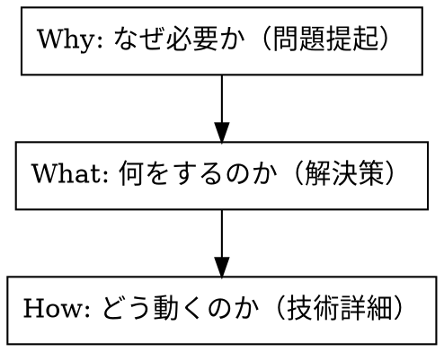

# Beginner-Friendly Documentation

## Overview

技術的に複雑なシステムを、前提知識ゼロの読者に伝えるためのドキュメント作成パターン。「正確さ」より「まず全体像を掴む」を優先する。

## When to Use

- 技術設計を非エンジニアのステークホルダーに説明する
- 初学者向けの Notion / Wiki ドキュメントを作成する
- ユーザーが「初学者なので」「わかりやすく」と依頼した
- 新メンバーのオンボーディング資料を作成する

## Core Pattern: Why → What → How



**NG:** いきなり技術仕様から始める
**OK:** 読者が「なるほど、だからこれが必要なのか」と腹落ちしてから詳細に入る

## Techniques

### 1. 比較表で概念を導入

新しい概念は、読者が知っているものと比較する。

```markdown
| 比較項目 | 銀行振込 | ブロックチェーン送金 |
|---|---|---|
| 送金時間 | 数時間〜翌営業日 | 約2秒 |
| 手数料 | 数百円 | 数円 |
| 管理者 | 銀行 | 公開台帳（誰でも検証可） |
```

### 2. たとえ話で直感的に理解させる

1つの概念に1つのたとえ話を対応させる。

| 技術概念 | たとえ話 |
|---|---|
| スマートコントラクト | 自動販売機（プログラム通りに必ず動く） |
| ブロックチェーン | 全員が同じコピーを持つ共有台帳 |
| 電子署名 | ハンコ付きの振込依頼書 |
| ガス代 | 取引処理してもらうための手数料（郵便切手） |
| マルチシグ | 金庫の鍵3本中2本ないと開かない |
| nonce | 整理券番号（1回限り有効） |
| immutable | 刻印（二度と変更できない） |

### 3. コールアウトで用語補足

本文の流れを止めずに、知らない用語をその場で説明する。

**用途別コールアウト使い分け（Notion）:**

| アイコン/色 | 用途 |
|---|---|
| 💡 yellow_bg | 用語解説・補足知識 |
| ⚠️ red_bg | 重要な注意点・リスク |
| ✅ green_bg | 解決策・防御済みの安全性 |
| 🔒 gray_bg | セキュリティ関連の補足 |
| 📖 blue_bg | ドキュメント全体の前提・スコープ |

### 4. 攻撃と防御を Q&A 形式で

セキュリティ説明は「悪い人がこうしたら？」→「こう防いでいる」の対話形式が最も伝わる。

```markdown
### 攻撃：「悪い人が関数を呼んで、お金を自分に送る」

> **防御：operator限定**
> settle() はホワイトリストに登録された operator だけが呼べる。
> 一般の人が呼ぼうとすると「NotOperator」エラーで弾かれる。
```

### 5. FAQ で設計判断を説明

「なぜこうしたか？」を Q&A で明示する。意思決定の背景がわかると理解が深まる。

```markdown
## Q: 手数料率は変更できる？
**はい。** settle() を呼ぶたびに引数で指定。コントラクトに固定値はない。
ただし上限50%はコードに直書きで変更不可。

## Q: コントラクトをアップグレードできる？
**いいえ（意図的に）。** アップグレード可能にすると攻撃者がコードを
書き換えるリスクが生まれる。128行のシンプルなコントラクトは再デプロイで十分。
```

## Document Structure Template

```markdown
# [ドキュメント冒頭の前提説明コールアウト]
「このドキュメントは○○向けです。技術的に正確であるよりも、
まず全体像を掴むことを優先しています。」

---

# まず最初に：何が起きているのか
[ビジネスの文脈。誰が何をして、どこにお金/データが流れるか]

# そもそも○○って何？
[比較表で既知の概念と対比]

# なぜ△△が必要なのか
[問題提起 → カストディ規制のような具体的リスク]
[たとえ話で直感的に理解]

# □□の仕組み（図解）
[登場人物テーブル（たとえ列付き）]
[フロー図（番号付きステップ）]

# セキュリティ：「これ安全なの？」
[攻撃 → 防御の Q&A 形式 × N個]
[残存リスクのコールアウト]

# 設計上の判断
[FAQ 形式で「なぜこうしたか？」を説明]

# 次にやること
[チェックリスト形式のタスク一覧]
```

## Subagent: Docs Writer

技術設計を初学者向けドキュメントに変換するプロンプト:

```
You are a technical writer specializing in beginner-friendly documentation.
Convert the provided technical design into documentation that assumes ZERO
prior knowledge.

Rules:
1. Start with WHY (problem), then WHAT (solution), then HOW (technical details)
2. Every new concept gets a comparison table (vs something the reader already knows)
3. Every technical term gets an analogy in a callout box
4. Security explanations use "attacker does X → defense Y" Q&A format
5. Design decisions use FAQ format ("Q: Can we change X? A: Yes/No, because...")
6. Use the登場人物 table with a たとえ column for every actor in the system
7. Write in Japanese unless instructed otherwise
8. Prefer Notion-flavored markdown with callout boxes (:::callout)

Output: Complete Notion-ready markdown document
```

## Common Mistakes

| 間違い | 正しい方法 |
|---|---|
| 技術仕様から書き始める | 「なぜ必要か」から始める |
| 専門用語を説明なしで使う | 初出時にコールアウトでたとえ話付き説明 |
| 正確性を優先して複雑にする | 「まず70%理解できる」ことを優先 |
| 全体を1つの長い文章にする | セクションごとに区切り、見出しで構造化 |
| たとえ話を省略する | 1概念1たとえ話を徹底 |
| 「詳しくはドキュメント参照」で逃げる | その場で説明を完結させる |
