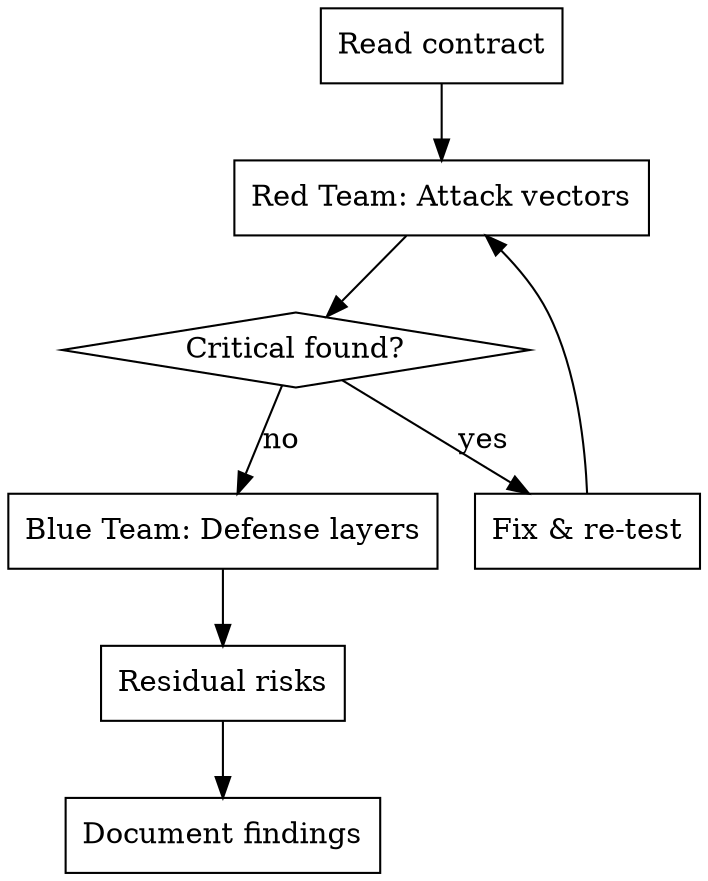

# Smart Contract Security Review

## Overview

スマートコントラクトを攻撃者（Red Team）と防御者（Blue Team）の両視点からレビューするフレームワーク。実装完了後、デプロイ前に必ず実施する。

## When to Use

- コントラクト実装が完了した直後
- テストネット/メインネットへのデプロイ前
- コントラクトのロジック変更後
- 外部からのコードレビュー依頼

## Review Process



## Red Team Checklist (攻撃者視点)

各関数について以下を検証する：

### 1. アクセス制御

- [ ] **誰が呼べるか？** — `public`/`external` 関数に制限がないならなぜか
- [ ] **msg.sender を偽装できるか？** — proxy 経由の delegatecall に注意
- [ ] **引数に攻撃者のアドレスを渡せるか？** — 受取先を自分に差し替える攻撃
- [ ] **owner/admin が単一アドレスか？** — 秘密鍵漏洩で全権限奪取

### 2. 資金フロー

- [ ] **フロントランニング可能か？** — mempool で tx を監視して先に実行
- [ ] **二重実行可能か？** — nonce/状態チェックの有無
- [ ] **送金先を改ざんできるか？** — 引数 vs immutable vs storage
- [ ] **手数料を操作できるか？** — ハードキャップの有無
- [ ] **コントラクトに資金が残留するか？** — 残高ゼロ検証の有無

### 3. 外部呼び出し

- [ ] **再入攻撃（reentrancy）** — 外部呼び出し後に状態変更していないか
- [ ] **戻り値を無視していないか？** — SafeERC20 を使っているか
- [ ] **ガスリミット攻撃** — 無限ループや巨大配列のイテレーション

### 4. 入力検証

- [ ] **ゼロアドレスチェック** — `address(0)` への送金は資金喪失
- [ ] **ゼロ金額チェック** — 意味のない tx でガスを浪費させる攻撃
- [ ] **オーバーフロー** — Solidity 0.8+ は自動チェックだが、unchecked ブロックに注意

## Blue Team Checklist (防御者視点)

### 防御レイヤー確認

| レイヤー | 確認事項 |
|---|---|
| ReentrancyGuard | 資金移動する関数に `nonReentrant` がついているか |
| Pausable | 緊急停止できるか。`whenNotPaused` が必要な関数についているか |
| SafeERC20 | `transfer()` ではなく `safeTransfer()` を使っているか |
| アクセス制御 | admin 関数に `onlyOwner` or カスタム modifier があるか |
| Immutable | 改ざんされてはいけない値が `immutable` or `constant` か |
| ハードキャップ | 手数料や金額に上限が設定されているか |
| 残高検証 | 決済後にコントラクト残高がゼロであることを検証しているか |
| イベント | 重要な状態変更に `emit` があるか（オフチェーン監視用） |
| rescue 関数 | 誤送金されたトークンを回収できるか |

### 残存リスク分類

| リスクレベル | 対応 |
|---|---|
| **Critical** | デプロイ前に必ず修正。資金喪失の可能性 |
| **High** | デプロイ前に修正推奨。攻撃シナリオが現実的 |
| **Medium** | 運用で緩和可能。監視・アラートで対処 |
| **Low/Info** | 改善推奨だがブロッカーではない |

## Real-World Example: settle() の脆弱性発見と修正

### 初版（脆弱）

```solidity
// 誰でも呼べる → 攻撃者が provider を自分のアドレスに差し替え可能
function settle(..., address provider, address platform, uint256 platformFee)
    external whenNotPaused nonReentrant { ... }
```

**攻撃シナリオ:** 攻撃者が mempool で正規の settle() tx を検知 → 同じ authorization で先に settle() を呼び、provider を自分のアドレスに設定 → 報酬を窃取。

### 修正後

```solidity
// 3つの修正:
// 1. onlyOperator でホワイトリスト制限
// 2. platformWallet を immutable に（引数から削除）
// 3. platform パラメータ削除
function settle(..., address provider, uint256 platformFee)
    external whenNotPaused nonReentrant onlyOperator { ... }
```

**教訓:**
- `public`/`external` で制限なしの関数は「誰でも呼べる」= 「攻撃者も呼べる」
- 送金先アドレスを引数で受け取る場合、呼び出し元を制限しないと差し替えられる
- 固定すべき値は immutable にして引数から消す

## Subagent: Security Reviewer

コントラクトのセキュリティレビューを委任するプロンプト:

```
You are a smart contract security auditor. Review the provided Solidity contract with:

**Red Team (攻撃者視点):**
For each external/public function:
1. Who can call it? Is access properly restricted?
2. Can arguments be manipulated to redirect funds?
3. Is frontrunning possible?
4. Can it be called multiple times (replay)?

**Blue Team (防御者視点):**
1. List all defense layers present (ReentrancyGuard, Pausable, etc.)
2. Identify missing defense layers
3. Check: immutable values, hard caps, balance verification, events

**Output format:**
- Table of attack vectors: vector | severity | status (mitigated/open) | details
- Table of defense layers: layer | status (present/missing) | notes
- Residual risks with mitigation recommendations
- Overall assessment: SAFE TO DEPLOY / NEEDS FIXES / CRITICAL ISSUES
```

## Common Mistakes

| 間違い | 正しい方法 |
|---|---|
| 「テスト通ったから安全」 | テストはハッピーパスを検証するもの。攻撃シナリオは別途レビューが必要 |
| 攻撃者視点を忘れる | 全ての external 関数で「攻撃者が呼んだらどうなる？」を考える |
| immutable にすべき値を storage に | 変更されてはいけない値は必ず immutable に |
| platform アドレスを引数で渡す | 固定すべき宛先はコントラクトに埋め込む |
| 「誰も悪意ある呼び出しはしない」 | パーミッションレスな環境では全員が攻撃者になりうる |

## Static Analysis (補助ツール)

```bash
# Slither（Python製の静的解析）
pip install slither-analyzer
slither contracts/src/MyContract.sol

# Mythril（シンボリック実行）
myth analyze contracts/src/MyContract.sol
```

レビューの最終判断は人間が行う。ツールは見落とし防止の補助。
